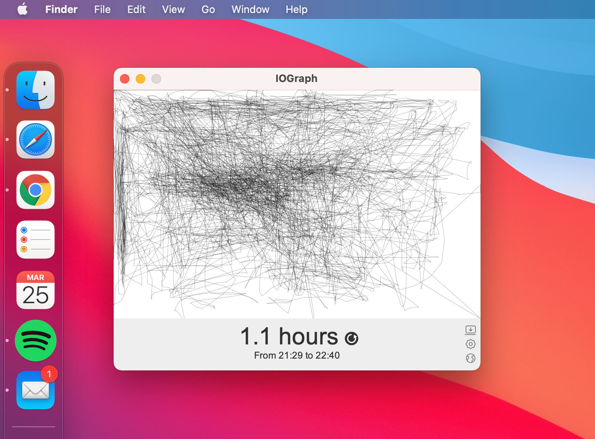

# IOGraph

### Turn your routine work into contemporary art

IOGraph — is an application that turns mouse movements into modern art. The idea is that you have the program running in the background while doing your usual daily stuff at the computer. Go back to IOGraph after a while and grab a nice picture of what you’ve done! It’s fun, useless and totally free!

### How to do this

1. [Download IOGraph](/github/v/release/:user/:repo) for your operating system.
1. Run IOGraph. It’s simple application. Just push the round button to start.
1. Do Your Business. Minimize IOGraph and forget about it for a while.
1. Do Art. Few hours later you’ll get your own piece of art.

### How to build it from source code

1. Download IOGraph's source code to your system.
2. Download and run [Eclipse IDE](https://www.eclipse.org/downloads/).
3. In Eclipse create new Java project (File > New > Java Project).
4. Uncheck "Use default location" check box in appeared dialog window.
5. Choose IOGraph's source code folder as Location and press Finish button.
6. In the "Package Explorer" panel locate IOGraph.java file (src > com.iographica.core) and right-click on it.
7. In appeared context menu select "Run as… > Java Application".
8. After few seconds IOGraphs main window have to be appeared.
