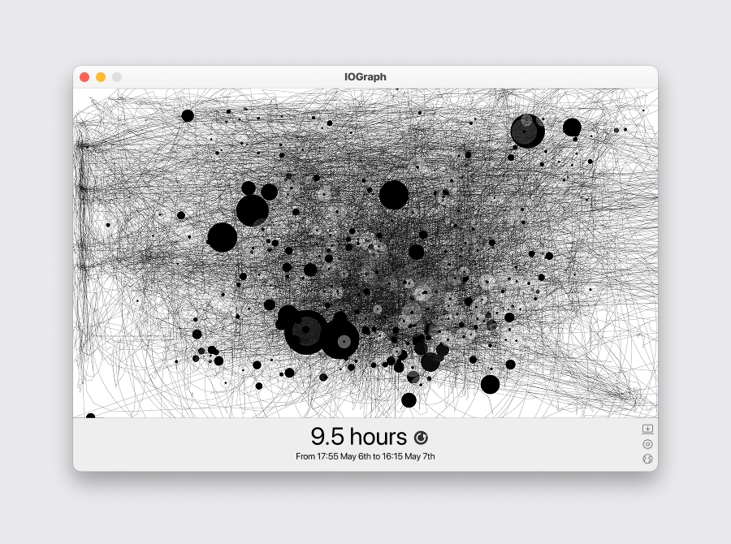

# IOGraph
<picture>
  <source media="(prefers-color-scheme: dark)" srcset="iograph-2.0.0-dark.jpg">
  
</picture>

### Turn your routine work into modern art

IOGraph — is an application that turns mouse movement into visual artifacts. The idea is simple: run IOGraph in the background while you go about your daily work. Later, return to the program and export an image generated from your activity.

IOGraph records only mouse movement. It does not record typing, clicks, files, applications, or screen content, and nothing is sent anywhere — everything happens locally on your computer. If you like, you can also place a screenshot of your screen behind the visualization to create a composite image.

You can save the resulting image and use it however you like.
